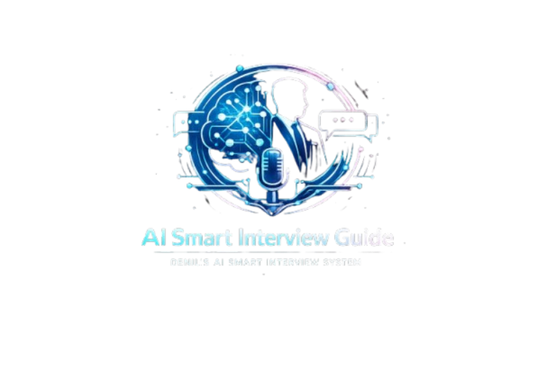

<p align="center">
  
</p>

<h1 align="center">🤖 AI Smart Interview Guide</h1>

<p align="center">
AI-powered interview simulation system that helps users prepare for real-world interviews using Resume Analysis, Voice AI Interviewer, Smart Evaluation, and AI-generated Feedback Reports.
</p>

<p align="center">
  
  
  
  
</p>

---

## 🚀 Project Overview

AI Smart Interview Guide is an intelligent AI-based system that simulates real interview environments.

It:
- Generates interview questions from resumes
- Conducts voice-based interviews
- Evaluates answers using AI
- Provides score + feedback report
- Helps users improve interview performance

---

## ✨ Features

### 🎯 AI Interview Engine
- Resume-based question generation
- Dynamic interview flow
- Real-time question progression

### 🎙 Voice Interview System
- AI interviewer voice (Text-to-Speech)
- Audio playback system
- Realistic interview simulation

### 🧠 Smart AI Evaluation
- Gemini AI-powered evaluation
- Scores for:
  - Communication Skills
  - Technical Knowledge
  - Confidence Level
  - Overall Performance

### 🎤 Speech Recognition
- Microphone-based answer input
- Real-time speech-to-text conversion

### 📊 Performance Dashboard
- Score visualization
- Radar/metrics view
- Progress tracking

### 📄 AI Report Generator
- Final interview report
- Downloadable PDF output
- Personalized feedback

---

## 🧠 AI Intelligence Features

- Google Gemini AI integration
- Prompt-engineered question generation
- Follow-up question system
- Context-based evaluation
- Adaptive interview flow

---

## 🏗 System Architecture

---

## 🛠 Tech Stack

- Python
- Streamlit
- Google Gemini AI
- Plotly
- SpeechRecognition
- gTTS / TTS
- FPDF
- dotenv

---

## 📁 Project Structure
AI_Smart_Interview_Guide/
│
├── app.py
├── interview_engine.py
├── followup_engine.py
├── smart_evaluator.py
├── resume_parser.py
├── report_generator.py
│
├── assets/
│ └── logo.png
│
├── requirements.txt
├── .gitignore
└── README.md


---

## 🚀 How to Run

```bash
git clone https://github.com/thedenilsonpinto/AI-Smart-Interview-Guide.git
cd AI-Smart-Interview-Guide
pip install -r requirements.txt
streamlit run app.py
